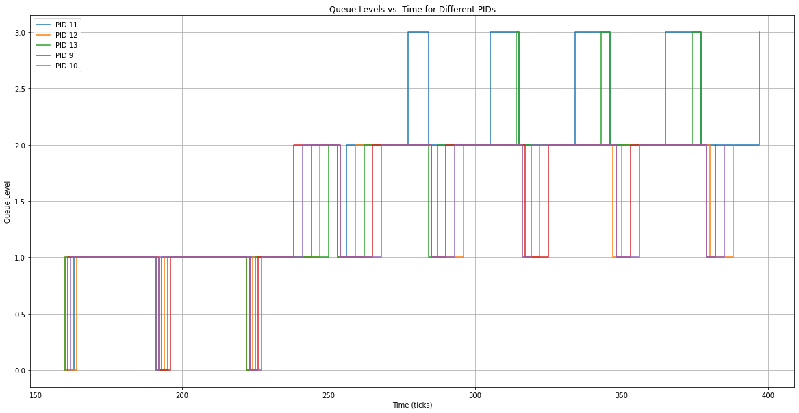
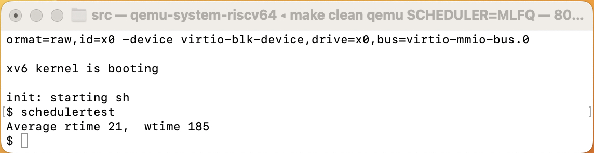

# README: Improvised XV6  by Aryan Gupta 


## Implementing the `getreadcount` System Call

### Step 1: Modify `syscall.h`

In the `syscall.h` file, add a new system call number for `getreadcount` at the end of the existing syscall numbers:

### Step 2: Implement `sys_getreadcount` in `syscall.c`

In the `syscall.c` file, implement the `sys_getreadcount` function. This function should simply return the `read_count` variable:

```c
uint64 sys_getreadcount(void)
{
  return read_count;
}
```

### Step 3: Update `syscall.c` for `sys_read`

In the same `syscall.c` file, update the `sys_read` function to increment the `read_count` variable each time the `read` system call is invoked:

```c
uint64 sys_read(void)
{
  read_count++;  // Increment read_count

  // Rest of the code for sys_read...
}
```

### Step 4: Update `user.h`

In the `user.h` file, declare the `getreadcount` function so that user-level programs can call it:

### Example of Using `getreadcount`

Simply run `getreadcount` after compiling and running. expected output `XV6_TEST_OUTPUT 0 1 1000`


## System Calls: `sigalarm` and `sigreturn` Logic

The `sigalarm` and `sigreturn` system calls in xv6 are designed to provide a mechanism for setting periodic alarms and handling interrupts triggered by these alarms. This section explains the logic and functionality of these system calls.

#### `sigalarm` System Call (`sys_sigalarm`)

The `sigalarm` system call is used to set up an alarm that triggers an action (handler function) after a specified number of timer ticks. Here's how it works:

1. **Setting Alarm Parameters**:
   - `myproc()->current_ticks = 0;`: The `current_ticks` variable of the current process is initialized to 0. This variable keeps track of how many timer ticks the process has consumed.

   - `argint(0, &myproc()->ticks);`: The `ticks` argument is retrieved from the user's memory space and stored in the `ticks` variable of the current process. This argument specifies the number of timer ticks before the alarm triggers.

   - `argaddr(1, &myproc()->handler);`: The `handler` argument is retrieved from the user's memory space and stored in the `handler` variable of the current process. This argument is a pointer to the handler function that will be called when the alarm triggers.

2. **Triggering the Alarm**:
   - In the `usertrap` function within `trap.c`, on each timer interrupt, the `current_ticks` for the current process is incremented.

   - When `current_ticks` reaches the value specified by `ticks` (i.e., the desired number of timer ticks), the alarm triggers.

   - A new memory page (PGSIZE) is allocated using `kalloc`, and the current trapframe is copied into this page. This memory page effectively saves the state of the process at the time of the alarm.

   - The program counter (`epc`) in the trapframe is set to the `handler` function. This ensures that the handler is called when the process resumes execution.

3. **Sigreturn and Reset**:
   - When the handler is executed, it is expected to call the `sigreturn` system call before returning. This is to ensure that the process returns to its previous state.

   - The `sigreturn` system call restores the trapframe from the saved memory page, effectively resetting the process to its state before the alarm triggered.

   - `current_ticks` is reset to 0, and the process continues its execution from where it left off.

#### `sigreturn` System Call (`sys_sigreturn`)

The `sigreturn` system call is responsible for restoring the process to its state before the alarm triggered and handling the return from the handler function. Here's how it works:

1. **Restoring Trapframe**:
   - The `sigreturn` system call retrieves the current process's `sigalarm` memory page (which contains the saved trapframe) and copies it back into the process's original trapframe.

2. **Memory Cleanup**:
   - The memory allocated for `sigalarm` is freed using `kfree`, as it is no longer needed.

3. **Resetting `current_ticks`**:
   - `current_ticks` is reset to 0, indicating that the process has not consumed any timer ticks after returning from the handler.

4. **Returning to User Space**:
   - The `sigreturn` system call ensures that the process returns to the address specified by `epc` in the restored trapframe, which is the point in the program where the alarm triggered.

#### Overall Logic

The `sigalarm` and `sigreturn` system calls work together to allow a process to set periodic alarms and handle the corresponding interrupts. The process keeps track of how many timer ticks it has consumed, and when the desired number of ticks is reached, the alarm triggers the handler. After the handler completes its task, it calls `sigreturn`, which restores the process's previous state, including the trapframe, and resets the tick count. This logic ensures that alarms can be used to execute periodic actions in a controlled manner within xv6.


# SCHEDULING

## First come First Serve

The First Come First Serve (FCFS) scheduling policy is a simple scheduling algorithm that selects processes based on their creation time (or spawn time). In this policy, the process that arrived first is given CPU time until it no longer needs it. Here is an explanation of how FCFS scheduling is implemented in xv6:

### Implementation Steps:


1. **Scheduling Logic in `scheduler()`**:
   - The FCFS scheduling logic is implemented in the `scheduler()` function in `kernel/proc.c`.
   - The FCFS scheduling policy is enabled using preprocessor directives, as indicated by `#ifdef FCFS`.
   - The scheduler iterates through all processes to find the process with the lowest `ctime` (creation time) which is already used by XV6 to mark creation time.
   - It uses the `ctime` (creation time) of each process to determine the creation order.
   - The process with the lowest `ctime` is selected as the next runnable process to execute.
   - If a runnable process is found, it is set to the `RUNNING` state, and its context is switched, allowing it to run on the CPU.
   - The `acquire` and `release` functions are used to protect access to the process's state and ensure synchronization.

2. **Disabling Preemption with Timer Interrupts**:
   - In FCFS scheduling, preemption is disabled to ensure that a process continues to run until it voluntarily gives up the CPU.
   - This is achieved by disabling timer interrupts (i.e., disabling the `yield()` function) in the `kerneltrap()` and `usertrap()` functions in `kernel/trap.c`. Preemption is disabled using preprocessor directives when FCFS is enabled.
   
### FCFS Scheduling Logic:

FCFS scheduling is straightforward and follows the "first come, first served" principle. The process with the lowest creation time (`ctime`) gets to run first. If there are multiple runnable processes, FCFS ensures that they are scheduled in the order they were created. Preemption is disabled to allow a process to run until it completes its execution or voluntarily gives up the CPU.

This scheduling policy is suitable for scenarios where processes should be executed in the order they arrive, such as in batch processing or scenarios where fairness is not a primary concern.

Please note that FCFS scheduling may not be the most efficient scheduling policy for all use cases, especially in interactive or time-sharing systems where responsiveness is essential. It can lead to poor performance in scenarios with long-running processes, as newer processes have to wait for older ones to complete.


## Multi Level Feedback Queue

The Multilevel Feedback Queue (MLFQ) scheduling algorithm is a preemptive scheduler that organizes processes into multiple priority queues. Processes can move between these queues based on their behavior and CPU burst times. MLFQ aims to provide good response times for interactive processes while ensuring that CPU-bound processes do not starve other processes. Here's how MLFQ scheduling is implemented in xv6:

### Implementation Steps:

1. **Process Structure Enhancements**:
   - The `struct proc` in `kernel/proc.h` is extended with several new fields to support MLFQ scheduling. These fields include `queue_level`, `tick_ctr`, `last_exec`, and `in_time`.

2. **Queue Level and Priority Management**:
   - The `queue_level` field stores the priority queue number for each process.
   - The `tick_ctr` field is used to store the runtime of the process, allowing for preemption.
   - `last_exec` keeps track of the last time a process was executed.
   - `in_time` is used to calculate the position of the process in the queue.

3. **Scheduler Logic in `scheduler()`**:
   - Within the `scheduler()` function in `kernel/proc.c`, MLFQ scheduling is implemented.
   - A loop iterates through all processes to find the process with the highest priority.
   - The process with the lowest `queue_level` and `in_time` values is selected.
   - This logic ensures that processes with lower `queue_level` values (higher priority) are scheduled first.
   - Preemption is handled by switching the context when a new process is scheduled.

4. **Timer Trap Handling in `kerneltrap()` and `usertrap()`**:
   - To handle timer interrupts and preempt running processes, the `mlfq_yield()` function is implemented.
   - `tick_ctr` is incremented for the currently running process to track its runtime.
   - Starvation: Processes with a queue level greater than 0 and a very long waiting times are are pushed to a lower queue with a higher priority, to ensure they get cpu time as well.
   - Aging: Processes that we use to prevent starvation, wehen we reach a defined wait time are upgraded to higher-priority queues.
   - Preemption: If a process exhausts its time slice (`tick_ctr` exceeds a limit), it is preempted using the `yield()` function.
   - Processes with lower `queue_level` values are considered higher priority and are scheduled first.

### MLFQ Scheduling Logic:

MLFQ scheduling aims to balance the execution of CPU-bound and I/O-bound processes by organizing them into multiple priority queues. The scheduler selects processes from the queue with the highest priority (`queue_level`). Aging and preemption are used to ensure fair execution and prevent starvation.

- Priority Queue Selection: The process with the lowest `queue_level` and `in_time` is scheduled first, ensuring that higher-priority processes run before lower-priority ones.
- Aging: Processes that wait too long are upgraded to higher-priority queues, preventing them from being starved.
- Preemption: If a process consumes its time slice or if a higher-priority process becomes runnable, the running process is preempted and another process is scheduled.

This combination of priority management, aging, and preemption allows MLFQ to adapt to the behavior of processes and ensure efficient CPU utilization while providing responsive behavior for interactive tasks.

MLFQ is a versatile scheduling algorithm that can strike a balance between fairness and throughput, making it suitable for various workloads and use cases.


### Round Robin within the queues of MLFQ

Multilevel Feedback Queue (MLFQ) scheduling essentially performs a Round-Robin (RR) scheduling within individual queues, which leads to an overall RR-like behavior for each priority level:

1. **Multiple Priority Queues**: In MLFQ, processes are divided into multiple priority queues, each assigned a different priority level. These queues are ordered in a decreasing priority sequence, with higher-priority queues at the top and lower-priority queues at the bottom.

2. **Varied Time Quanta**: Each queue is assigned a specific time quantum, which determines how long a process from that queue is allowed to run on the CPU before it's either preempted or voluntarily yields the CPU. Higher-priority queues usually have shorter time quanta to ensure that important tasks receive quicker attention.

3. **Queue Selection**: When it's time to select the next process to run, the scheduler starts with the highest-priority queue (the one at the top) and proceeds to lower-priority queues. It checks if a queue has any runnable processes.

4. **Round-Robin Within Queues**: Within each priority queue, RR scheduling is applied. The scheduler selects the process which was pushed in the queue at the oldest time `in_time` is used to find the oldest process. This process runs for its allocated time quantum. If it finishes its execution before the time quantum expires, it voluntarily yields the CPU. If not, it's preempted when the time quantum limit is reached.

5. **Priority-Based Preemption**: After a process either completes its time quantum or voluntarily gives up the CPU within a queue, the scheduler checks if there are runnable processes in higher-priority queues. If a higher-priority queue contains runnable processes, one of those processes is selected to run next. This ensures that processes with higher priorities get immediate attention.

6. **Aging and Queue Upgrades**: To avoid the starvation of processes in lower-priority queues, aging is introduced. Aging means that processes waiting in lower-priority queues are occasionally moved to higher-priority queues. This way, even processes in lower-priority queues eventually get a chance to execute in higher-priority queues.

7. **Queue Downgrades**: When a process within a queue consumes its entire time quantum and other runnable processes are present in the same queue, it's placed at the back of the same queue. This practice enforces RR scheduling within each individual priority queue.

8. **Queue-Level Control**: The time quantum and scheduling behavior of each priority queue are managed by the scheduler. Lower-priority queues often have longer time quanta to allow CPU-bound processes more extended execution periods.

By utilizing this combination of RR scheduling within queues and priority-based preemption, MLFQ effectively ensures a balanced approach to scheduling. It guarantees that processes receive timely attention, maintains fairness, and enables efficient CPU utilization. Overall, the MLFQ scheduler mimics an RR-like behavior within individual queues while incorporating dynamic priority adjustments based on process behavior.

### graph for various changes in schedulertest




---

## Priority-Based Scheduler 

This project implements a non-preemptive priority-based scheduler in the xv6 operating system. The scheduler selects the process with the highest priority for execution, considering both static and dynamic priorities. In cases where multiple processes have the same priority, the scheduler uses the number of times a process has been scheduled and its start time to break ties.

### Features

- **Static Priority (SP):** The static priority of a process is an integer value in the range [0, 100], where lower values represent higher priority. The default priority for a process is set to 50.

- **Dynamic Priority (DP):** The dynamic priority of a process depends on its static priority and Recent Behavior Index (RBI). The RBI measures recent behavior, which is a weighted sum of Running Time (RT), Sleeping Time (ST), and Waiting Time (WT). The default value of RBI is 25.

- **System Call `set_priority`:** A new system call `set_priority` allows changing the static priority of a process. The system call takes two arguments: the process ID (PID) and the new priority. It returns the old static priority of the process. If the new priority is lower than the previous priority, rescheduling is performed. Calling this system call also resets the RBI to 25.

- **User Program `setpriority`:** An accompanying user program named `setpriority` is implemented to change the priority of a process. It takes the process ID and the new priority as command-line arguments.

### System Call Implementation

The `set_priority` system call is implemented in the kernel and can be called as follows:

```c
int set_priority(int pid, int new_priority);
```

- `pid`: The process ID of the target process.
- `new_priority`: The new static priority to set for the process.

The system call returns the old static priority of the process and may trigger rescheduling if the new priority is lower.

### `sys_set_priority` Implementation

The `sys_set_priority` function in the code handles the `set_priority` system call:


The function takes the new priority and process ID as arguments and adjusts the process's priority accordingly. It also resets the RBI and may trigger a rescheduling if the new priority is lower than the old priority.

### Scheduler (`sched_pbs`)

The `sched_pbs` function selects the process with the highest dynamic priority for execution. It calculates the dynamic priority using the given formula and takes into account the number of times a process has been scheduled and its start time to break ties.

### Updating Dynamic Priority (`clockintr`)

The `clockintr` function in `trap.c` is used to update the running, sleeping, and waiting times of processes based on their current states. This information is used to calculate the dynamic priority.

### graph for various changes in schedulertest (increasing priority of IO processes and fixing for a few)


---


# Comparing on a single CPU

## MLFQ


## FCFS


## RR


## PBS


---
# xv6 Copy-on-Write (COW) 

## Introduction

The Copy-on-Write (COW) mechanism in xv6 is designed to enhance memory efficiency during the creation of child processes through the fork system call. Instead of immediately duplicating the memory content of the parent process for the child, the COW implementation allows both processes to share the same pages initially. Only when a process attempts to modify a shared page is a copy created, ensuring that modifications do not affect the other process.

## Code Modifications

### kinit

The initialization function `kinit` has been modified to include the initialization of `nump_using` array, which keeps track of the number of processes using each page. This array is essential for implementing the COW mechanism.

```c
int nump_using[(PGROUNDUP(PHYSTOP)/PGSIZE)];
struct spinlock nump_using_lock;
void
kinit()
{
  // ... (existing code)
  // COW init nump_using as 0
  initlock(&nump_using_lock,"nump_using lock");
  acquire(&nump_using_lock);
  int sz;
  int i = 0;
  sz = PGROUNDUP(PHYSTOP)/PGSIZE;
  while(sz > i)
  {
    nump_using[i] = 1;
    i++;
  }
  release(&nump_using_lock);
  // ... (existing code)
}
```

### kfree and kalloc

The memory management functions `kfree` and `kalloc` have been updated to support the COW mechanism. Pages are marked for COW when they are allocated, and the count of processes using a page is updated accordingly during allocation and deallocation.

```c
void *
kalloc(void)
{
  // ... (existing code)
  int idxx = (uint64)r/PGSIZE;
  acquire(&nump_using_lock);
  nump_using[idxx] = nump_using[idxx] + 1;  // mark that this page is being used by one more process
  if(nump_using[idxx] < 1)
    printf("kalloc: nump_using < 1");
  release(&nump_using_lock);
  // ... (existing code)
}

void
kfree(void *pa)
{
  // ... (existing code)
  int flg = 0;
  acquire(&nump_using_lock);
  int idx = (uint64)pa/PGSIZE;
  nump_using[idx] = nump_using[idx] - 1;  // decrement the count of the number of processes using this page 
  if(nump_using[idx] >= 1)
    flg = 1;
  if(nump_using[idx] < 0)
    printf("kfree: nump_using < 0");
  release(&nump_using_lock);
  if(flg == 1)
    return;
  // ... (existing code)
}
```

### trap.c

The trap handling in `trap.c` has been extended to include handling for page faults (scause == 15). When such a fault occurs, the corresponding page is marked for `removecopy()`

```c
// trap.c
if(r_scause() == 15)    // COW
  p->killed = removecopy(p->pagetable,r_stval(), PGROUNDDOWN(p->trapframe->sp)); 
```

### uvmcopy and removecopy

The functions responsible for copying the memory content from a parent process to a child process, `uvmcopy`, and creating a new page for COW, `removecopy`, have been introduced. These functions manage the transition from shared pages to private pages during fork.

```c
int
removecopy(pagetable_t pt, uint64 va, uint64 sz)
{
  char *mem;
  va = PGROUNDDOWN(va);
  if (MAXVA <= va)
  {
    printf("removecopy: va not available\n");
    return 1;
  }
  if (sz != 0 && (va > sz - PGSIZE && va < sz))    // if size defined, check for availaible space
  {
    printf("removecopy: size not available\n");
    return 1;
  }
  pte_t *pte = walk(pt,va,0);
  if(!(*pte & PTE_V) || !(*pte & PTE_COW))
  {
    printf("removecopy: page not valid or not COW");
    return 1;
  }
  uint64 flags = PTE_FLAGS(*pte);      // get the flags
  flags = flags & (~PTE_COW);          // remove COW flag
  flags |= PTE_W;                      // add write permission
  if((mem = kalloc())==0)              // allocate a new page
  {
    panic("removecopy: kalloc error");
    return 1;
  }
  uint64 pa = PTE2PA(*pte);            // get the physical address
  memmove(mem,(char*)pa,PGSIZE);
  *pte = PA2PTE(mem)|flags;
  kfree((void*)pa);
  return 0;
}
```

### copyout

The `copyout` function has been enhanced to handle COW pages. If a page is marked for COW, it triggers the creation of a new private page.

```c
int
copyout(pagetable_t pagetable, uint64 dstva, char *src, uint64 len)
{
  // ... (existing code)
  if(*walk(pagetable,va0,0) & PTE_COW)
  {
    removecopy(pagetable,va0, 0);
    pa0 = walkaddr(pagetable,va0);
  }
  // ... (existing code)
}
```

The COW implementation in xv6 enhances memory efficiency during process creation, allowing for more economical use of physical pages. The modified code includes the necessary changes to support shared and private pages, making xv6 an even more versatile and resource-conscious operating system. Feel free to explore the code and experiment with the COW mechanism for a deeper understanding of its impact on system behavior.
---


